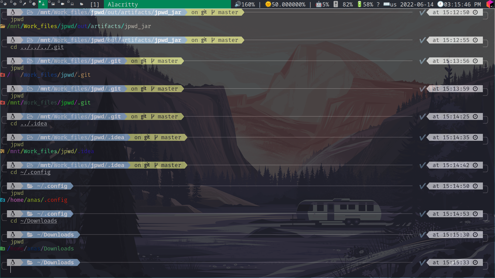

## jpwd: A modern alternative to GNU/pwd using Java 🥰☕

- Requires jdk 17+ and [nerd-fonts](https://www.nerdfonts.com)

### Features
- Colorful output
- Customizable colors for directories names and separator
- Customizable separator
- Supports multiple separators
- Supports icons for directories
- Supports no icons and no colors modes
- Cross-platform (macOS, Windows, Linux) 🌍

### Options table
| Option                       | Value                                                                 | Description                                                                                                                                          |
|------------------------------|-----------------------------------------------------------------------|------------------------------------------------------------------------------------------------------------------------------------------------------|
 | `-h` or `--help`             | n/a                                                                   | Show the help message                                                                                                                                |
| `-v` or `--version`          | n/a                                                                   | Show the version                                                                                                                                     |
 | `-s` or `--separator`        | Separator string                                                      | Set the separator (like '-'), accept strings and characters, default is system separator (like '\' in windows or '/' in linux and unix like systems) |
 | `-sc` or `--separator-color` | Color name or hex value, e.g `red` or `#ff000000                      | Set the separator color, accept strings and colors, default is random color                                                                          |
 | `-nc` or `--no-colors`       | n/a                                                                   | Disable colors                                                                                                                                       |
 | `-b` or `--background`       | Color name or hex value, e.g `red` or `#ff000000                      | Set the background color, accept strings and colors, default is none                                                                                 |
 | `-ni` or `--no-icons`        | n/a                                                                   | Disable icons                                                                                                                                        |
 | `-bc` or `--block-colors`    | Block colors list like `red,green,blue` or `#ff000000,#00ff0000`      | Set a list of dont use colors                                                                                                                        |
 | `-cl` or `--colors-list`     | List of allowed colors like `red,green,blue` or `#ff000000,#00ff0000` | Set a list of colors, like "#5f44a4,red" If you use this option, it means that you have blocked all colors except for the ones you passed.           |

## Requirements for development:
- [nerd-font](https://www.nerdfonts.com)
- Maven
- jdk 17
- IntelliJ IDEA (not required but recommended)

## TODO
- [ ] Add Tests
- [ ] Add Formatter
- [ ] Crete arch package
- [ ] Create debian package
- [ ] Add `-L` and `-P` options like the original pwd

### Available in 

